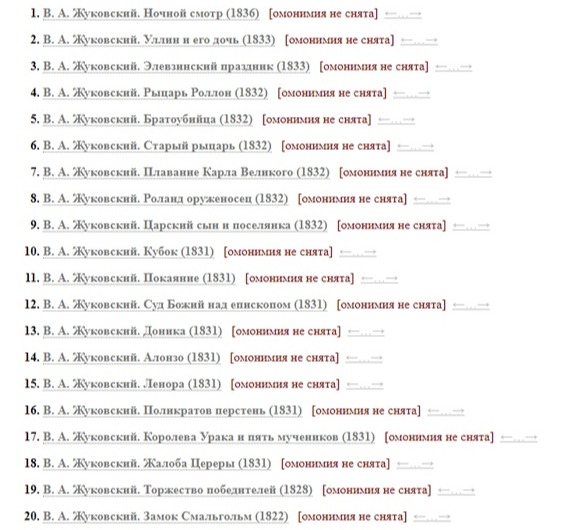
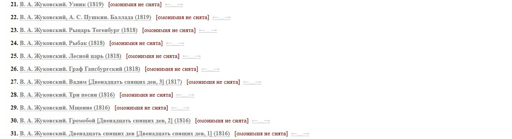
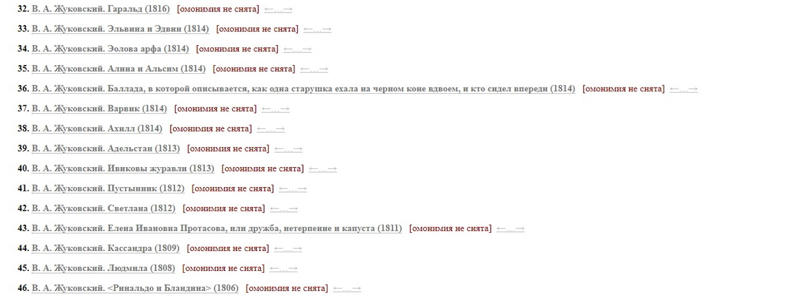
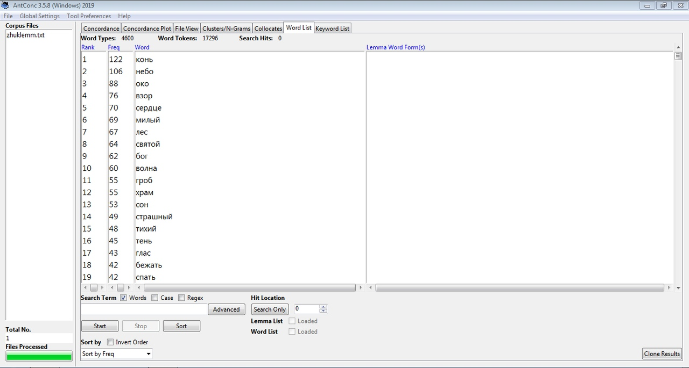
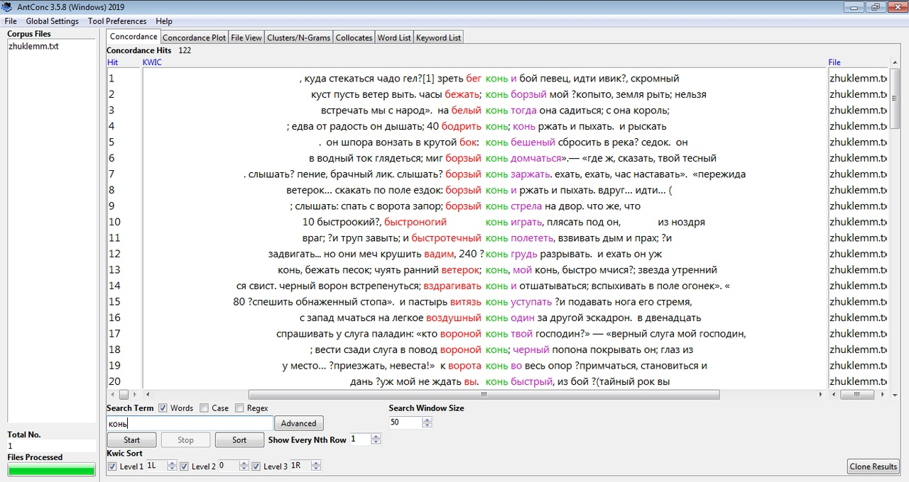
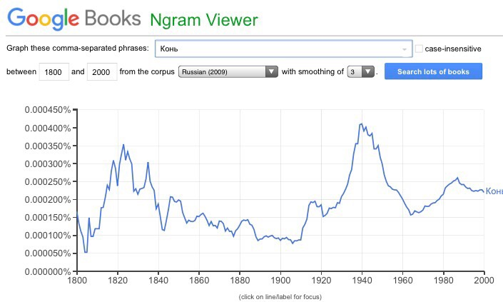

## <center> Василий Андреевич Жуковский. Реализация романтических мотивов в корпусе баллад 

### Мотивировка исследования

```markdown
Идейный вдохновитель исследования – Андрей Семенович Немзер.
Прошедший на Филологическом факультете НИУ ВШЭ курс
"Ключевые тексты русской литературы XIX века", часть которого
была посвящена анализу баллад Василия Андреевича Жуковского, 
заставил нас глубже заинтересоваться выражением романтического
течения в данных произведениях.
```

### Цель исследования

```markdown
Целью данного исслеования является изучение текстов баллад
В. А. Жуковского с точки зрения мотивного аспекта.
Выделенные десять основных мотивов сорока пяти баллад 
изучались нами в рамках корпусного исследования.

Использованные программы – НКРЯ; AntConc; Google NGrams.

Особое внимание уделялось ключевым словам, маркирующим темы,
и их сочетаемости с рядом стоящими словами. На основе полученных
результатов для каждого мотива мы проводили интерпретацию,
связанную только с балладами Жуковского, ведь в его произведениях
слова имеют особый закреплённый за ним смысловой оттенок,
не совпадающий с обычно свойственными коннотациями,
и применимый только к нашему корпусу. 
```

### Список анализируемых баллад





### Перечень наиболее частотных мотивов



#### Конь



